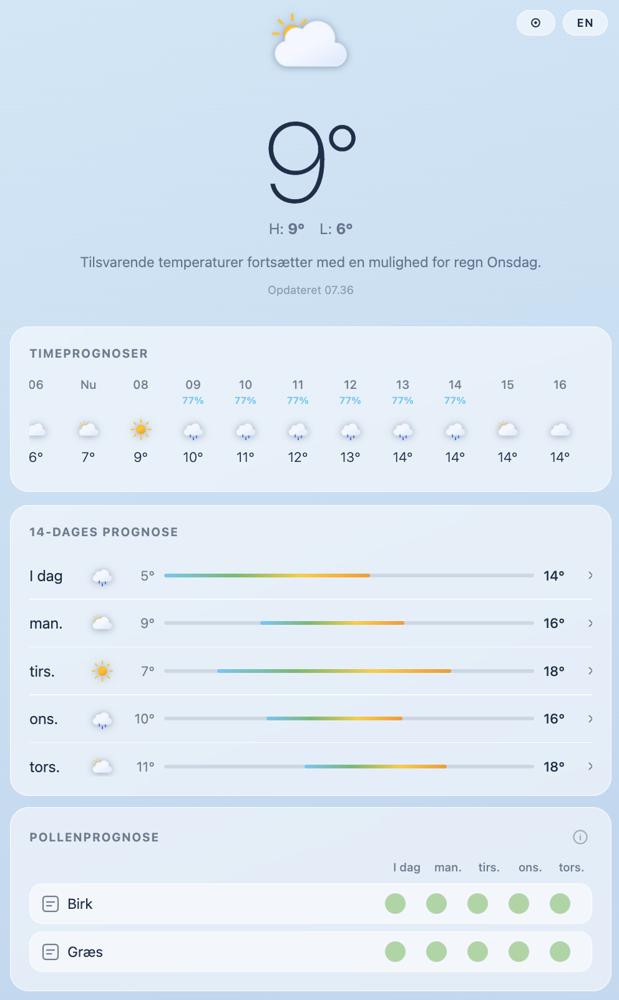
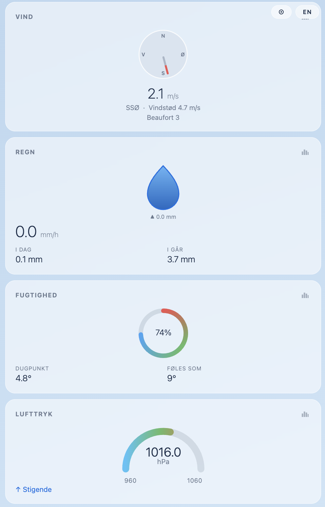
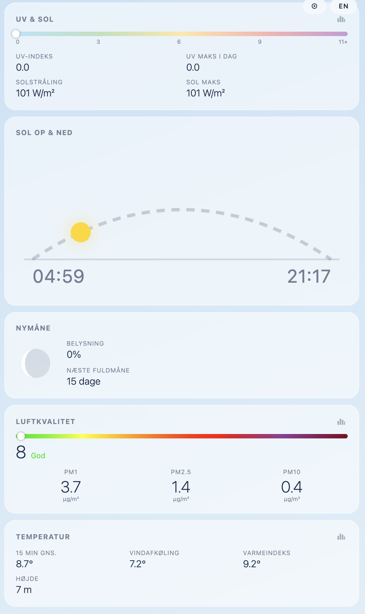

# LocalWeather

<!-- cSpell:words gunicorn pytz localweather Meteocons Glassmorphism WSGI forecas chartjs jsdelivr uvsolar airquality pollen birk bynke graes hassel alternaria cladosporium koebenhavn -->

A responsive, Apple Weather-inspired dashboard that reads real-time data from a local MySQL database and displays it in a browser or as an iOS/Android home screen web app.

  

## Features

- **Real-time weather** — temperature, wind, rain, humidity, pressure, UV index, solar radiation, air quality (PM1 / PM2.5 / PM10 with AQI)
- **Hourly forecast** — scrollable 72-hour strip, automatically positioned at the current hour
- **14-day forecast** — vertically scrollable daily strip with temperature range bars; tap any row to expand an accordion panel showing rain, wind, pressure, sunrise/sunset times, and a weather description — only one day is open at a time
- **Sunrise & sunset** — animated arc showing the sun's current position through the day
- **Moon phase** — SVG phase graphic, illumination percentage, and days to next full moon
- **Pressure gauge** — semi-circular speedometer-style arc gauge for barometric pressure
- **36-hour history charts** — every non-forecast widget has a chart button that opens a modal popup with a Chart.js time-series graph drawn from `minute_data`
- **Light / dark / auto theme** — follows OS preference automatically, with a manual toggle (⊙ → ☀ → ☾) that persists in `localStorage`
- **EN / DA language toggle** — all widget labels and values switch between English and Danish, preference saved in `localStorage`
- **PWA / iOS web app** — installable on iPhone/iPad, supports `viewport-fit=cover` and safe-area insets
- **Pollen forecast** — 5-day pollen widget showing counts and severity (low / moderate / high / very high) for up to 8 types (Birch, Mugwort, Alder, Elm, Grass, Hazel, Alternaria, Cladosporium); only types with at least one active severity day are displayed; today's detail panel expands inline
- **Rain gauge drop** — SVG raindrop outline in the rain widget fills from the bottom based on how much of today's precipitation forecast has fallen; if actual rain exceeds the forecast the max scales up automatically so the drop never overflows
- **Auto-refresh** — data updates every 60 seconds without a page reload

## Screenshots

<a href="Docs/screenshots/LocalWeather_1.png"></a>
<a href="Docs/screenshots/LocalWeather_2.png"></a>
<a href="Docs/screenshots/LocalWeather_3.png"></a>

## Architecture

```text
MySQL (weather_history)
  ├── realtime_data      ← live station readings
  ├── forecast_hourly    ← 72-hour hourly forecast
  ├── forecast_daily     ← 14-day daily forecast
  ├── minute_data        ← per-minute history (36-hour chart source)
  └── pollen_data        ← 5-day pollen forecast per region

Flask (app.py)  →  Jinja2 template  →  Browser
                →  /api/data        ← JS polled every 60 s
                →  /api/hourly
                →  /api/daily
                →  /api/history     ← history charts (36 h of minute_data)
                →  /api/pollen     ← 5-day pollen forecast (region-filtered)
```

## Configuration

Copy [.env.example](.env.example) to `.env` and edit the values before deploying:

```bash
cp .env.example .env
```

```ini
# Station location — used for sunrise/sunset and moon calculations
STATION_LAT=55.64
STATION_LON=12.09
STATION_TZ=Europe/Copenhagen

# Pollen forecast region (must match the `region` column in pollen_data)
POLLEN_REGION=koebenhavn

# MySQL database connection
DB_HOST=192.168.1.9
DB_NAME=weather_history
DB_USER=weather_user
DB_PASSWORD=your-password
DB_CONNECT_TIMEOUT=5
```

The `.env` file is never committed to the repository. On a fresh production deployment the deploy script copies `.env.example` to `.env` automatically if no `.env` is present — edit `/opt/localweather/.env` afterwards to set your real credentials.

## Database Schema

The app reads from three tables. Reference schemas are in [Docs/](Docs/).

| Table | Description |
| --- | --- |
| `realtime_data` | Latest station reading (temperature, wind, rain, UV, AQI sensors, …) |
| `forecast_hourly` | One row per forecast hour (`hour_num` 0–71, starting midnight local time) |
| `forecast_daily` | One row per forecast day (`day_num` 0–13) |
| `minute_data` | Per-minute historical readings, queried for the last 36 hours by `/api/history` |
| `pollen_data` | One row per region per date; columns follow the pattern `{type}_count` / `{type}_severity` for each of the 8 pollen types |

## Development

### Prerequisites

- [Docker Desktop](https://www.docker.com/products/docker-desktop/) (or Docker Engine + Compose)
- VS Code with the [Dev Containers](https://marketplace.visualstudio.com/items?itemName=ms-vscode-remote.remote-containers) extension (optional but recommended)

### Quick start (terminal)

```bash
git clone https://github.com/briis/LocalWeather
cd LocalWeather
docker compose up --build
```

The app is available at <http://localhost:8080>.

The project directory is mounted as a volume inside the container, so edits to any Python, HTML, or CSS file are picked up immediately by Flask's development server — no rebuild required. Structural changes (new dependencies in `requirements.txt`, changes to the `Dockerfile`) do require a rebuild:

```bash
docker compose up --build
```

### Dev Containers (VS Code)

The repo includes a `.devcontainer` configuration that wires VS Code directly into the running container:

1. Open the repo folder in VS Code.
2. When prompted, click **Reopen in Container** (or run `Dev Containers: Reopen in Container` from the command palette).
3. VS Code attaches to the `web` service defined in `docker-compose.yml`, forwards port 5000, and opens a browser tab automatically.

Recommended extensions (installed automatically inside the container):

| Extension | Purpose |
| --- | --- |
| `ms-python.python` | Python language support and IntelliSense |
| `ms-python.debugpy` | Debugger — attach to the running Flask process |
| `GitHub.vscode-pull-request-github` | PR and issue management |

### Database access from the container

The container uses `extra_hosts: host.docker.internal:host-gateway` so the Flask app can reach a MySQL instance running on your host machine. Update `DB_HOST` in `.env` to `host.docker.internal` instead of a bare IP if needed.

### Linting

```bash
bash scripts/lint
```

Runs `ruff format` (auto-formats) then `ruff check --fix` (auto-fixes lint errors) across the whole project. Configuration is in [.ruff.toml](.ruff.toml).

## Production Deployment (Proxmox LXC)

Run the deploy script on the LXC as root. It installs all dependencies, sets up a Python virtual environment, configures `gunicorn` as a systemd service, and puts nginx in front of it.

```bash
# With a GitHub Personal Access Token (recommended)
GITHUB_TOKEN=ghp_xxxxxxxxxxxx bash deploy/deploy.sh

# Or from a local clone (copy files first)
bash deploy/deploy.sh
```

The script will:

1. Install `python3`, `nginx`, and `git` via `apt`
2. Clone / pull the repository into `/opt/localweather`
3. Remove dev-only files (`Dockerfile`, `docker-compose.yml`, `scripts/`, `Docs/`, `.devcontainer/`, etc.) from the deployment directory
4. Create a Python virtual environment and install `requirements.txt`
5. Install and start the `localweather` systemd service (Gunicorn)
6. Configure nginx as a reverse proxy and restart it

The app will be served on **port 80** of the LXC's IP address.

### Deployment files

| File | Purpose |
| --- | --- |
| [deploy/deploy.sh](deploy/deploy.sh) | One-shot install + update script |
| [deploy/localweather.service](deploy/localweather.service) | systemd unit for Gunicorn |
| [deploy/localweather.nginx](deploy/localweather.nginx) | nginx reverse proxy config |

## API Endpoints

| Endpoint | Description |
| --- | --- |
| `GET /` | Main dashboard (server-rendered HTML) |
| `GET /api/data` | Latest realtime data as JSON, including AQI, sun, and moon |
| `GET /api/hourly` | Hourly forecast (72 entries) as JSON |
| `GET /api/daily` | Daily forecast (14 entries) as JSON |
| `GET /api/history?fields=f1,f2` | Last 36 hours of `minute_data` for the requested fields as JSON. Allowed fields: `temperature`, `wind_chill`, `heat_index`, `humidity`, `dewpoint`, `rain_rate`, `rain_day`, `wind_speed`, `wind_gust`, `pressure`, `uv`, `solar_radiation`, `air_Quality_pm1`, `air_Quality_pm10`, `air_Quality_pm25` |
| `GET /api/pollen` | Next 5 days of pollen forecast for the configured `POLLEN_REGION` as JSON |

## Project Structure

```text
LocalWeather/
├── app.py                        # Flask app, DB queries, AQI / sun / moon logic
├── aqi_calculator.py             # EPA AQI calculation from PM2.5 and PM10
├── requirements.txt
├── .env.example                  # Configuration template — copy to .env and edit
├── LocalWeather.code-workspace   # VS Code workspace file
├── templates/
│   └── index.html                # Single-page Jinja2 template
├── static/
│   ├── css/style.css             # Glassmorphism UI, responsive grid, light/dark theme
│   ├── js/weather.js             # Auto-refresh, language/theme switching, forecast builders, history charts
│   ├── images/                   # Meteocons PNG weather icons
│   ├── favicon.svg
│   ├── apple-touch-icon-source.svg  # Source SVG for the iOS home screen icon
│   ├── apple-touch-icon.png      # iOS home screen icon (180×180)
│   ├── icon-192.png              # PWA icon (192×192)
│   ├── icon-512.png              # PWA icon (512×512)
│   └── manifest.json             # PWA manifest
├── deploy/                       # Production deployment scripts
│   ├── deploy.sh                 # One-shot install + update script
│   ├── localweather.service      # systemd unit for Gunicorn
│   └── localweather.nginx        # nginx reverse proxy config
├── Dockerfile                    # Dev environment only
├── docker-compose.yml            # Dev environment only
├── docker-compose.override.yml   # Local overrides (ports, volumes) — not committed
├── .devcontainer/                # VS Code Dev Containers config
├── .vscode/
│   └── settings.json             # Workspace editor settings
├── .ruff.toml                    # Linter config
├── scripts/
│   └── lint                      # Run ruff format + check
└── Docs/                         # Reference SQL schemas and example data
    ├── realtime_data_structure.sql
    ├── forecast_data_structure.sql
    ├── minute_data_structure.sql
    ├── pollen_data_structure.sql
    ├── example_minute_data.json
    ├── example_pollen_data.json
    ├── example_forecast_daily.json
    └── example_forecast_hourly.json
```

## Dependencies

| Package | Purpose |
| --- | --- |
| `flask` | Web framework |
| `mysql-connector-python` | MySQL database access |
| `astral` | Sunrise / sunset and moon phase calculations |
| `pytz` | Timezone-aware datetime handling |
| `gunicorn` | Production WSGI server (installed by deploy script) |

### Frontend libraries (CDN, no install required)

| Library | Version | Purpose |
| --- | --- | --- |
| [Chart.js](https://www.chartjs.org/) | 4.5.1 | Time-series history charts |
| [chartjs-adapter-date-fns](https://github.com/chartjs/chartjs-adapter-date-fns) | 3.0.0 | Date/time axis adapter for Chart.js |

## License

MIT — see [LICENSE](LICENSE).
